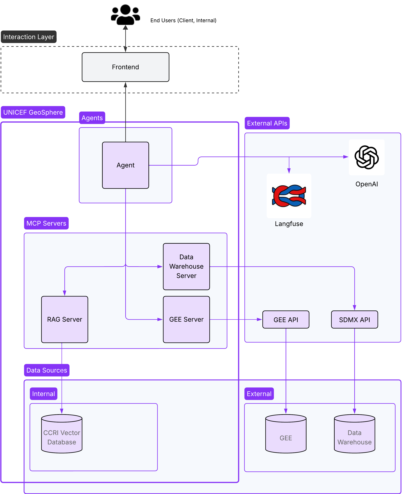

# UNICEF Geosphere - Democratizing Access to Complex Data

## Overview

The UNICEF Geosphere project aims to democratize access to highly complex data through an innovative architecture that combines artificial intelligence with specialized data sources. This project provides a unified interface for querying diverse datasets including statistical data, climate risk information, and geospatial data from Google Earth Engine.

## Architecture

The project consists of several interconnected components working together to provide seamless access to complex data:



## Components

### 1. **UNICEF Frontend**

- **Technology**: React with TypeScript
- **Purpose**: User interface for interacting with the AI agent
- **Features**:
  - Modern, responsive design
  - Real-time chat interface with the AI agent
  - Data visualization capabilities

### 2. **UNICEF Agent**

- **Technology**: Large Language Model (LLM) with tool calling capabilities
- **Purpose**: Acts as an intelligent intermediary between users and data sources
- **Features**:
  - Natural language processing for user queries
  - Tool calling to interact with MCP servers
  - Data synthesis and interpretation
  - Context-aware responses

### 3. **Model Context Protocol (MCP) Servers**

The system utilizes three specialized MCP servers, each providing access to different data sources:

#### **Data Warehouse MCP**

- **Repository**: `unicef-datawarehouse-mcp`
- **Purpose**: Provides access to UNICEF's comprehensive data warehouse
- **Data Sources**:
  - Statistical data from various countries
  - Demographic information
  - Health and education metrics
  - Economic indicators
- **Capabilities**:
  - Query tabular data with filters
  - Aggregate and analyze statistical information

#### **RAG MCP**

- **Repository**: `unicef-rag-mcp`
- **Purpose**: Retrieval-Augmented Generation based on Children's Climate Risk Index (CCRI) Technical Documentation
- **Data Sources**:
  - CCRI Technical Documentation
  - Technical specifications and methodologies
  - Metadata for climate risk assessments
- **Capabilities**:
  - Semantic search through technical documentation
  - Provide context and explanations for climate risk data
  - Support metadata queries for Google Earth Engine assets

#### **Google Earth Engine MCP**

- **Repository**: `unicef-gee-mcp`
- **Purpose**: Interface with Google Earth Engine for geospatial data
- **Data Sources**:
  - Satellite imagery
  - Natural hazard datasets (floods, droughts, storms)
  - Demographic spatial data
  - Climate and environmental indicators
- **Capabilities**:
  - Query and analyze geospatial datasets
  - Generate maps and visualizations
  - Perform spatial analysis
  - Access UNICEF's specialized Earth Engine assets

## Open Source Commitment

All components of this project are open source and available on GitHub.

## Quick Start

### Prerequisites

- Docker and Docker Compose
- Git

### Installation

1. **Clone the main repository with submodules:**

```bash
git clone --recursive git@github.com:tryolabs/unicef-geospatial.git
cd unicef-geospatial
```

2. **Start the entire system:**

```bash
docker-compose up -d
```

3. **Access the application:**

- Frontend: http://localhost:3000
- Agent API: http://localhost:8000
- MCP Servers: Various ports as configured

### Development Setup

For local development of individual components, Node.js and [uv](https://docs.astral.sh/uv/getting-started/installation/) are required.

1. **Frontend Development:**

```bash
cd frontend
npm install
npm run dev
```

2. **Agent Development:**

```bash
cd agent
uv sync
uv run agent/server.py
```

3. **MCP Server Development:**

```bash
# For each MCP server
cd [mcp-server-directory]
uv sync
uv run [mcp-server]/server.py
```

## Configuration

### Docker Compose Services

The `docker-compose.yml` file orchestrates the following services:

- **frontend**: React application (port 3000)
- **agent**: LLM agent service (port 8000)
- **datawarehouse-mcp**: Data warehouse MCP server (port 8001)
- **rag-mcp**: RAG MCP server (port 8002)
- **gee-mcp**: Google Earth Engine MCP server (port 8003)
- **nginx**: Reverse proxy for routing (port 80)

## API Documentation

TODO

## Contributing

We welcome contributions to improve the UNICEF Geosphere project:

1. Fork the repository
2. Create a feature branch
3. Make your changes
4. Submit a pull request

### Development Guidelines

- Follow the existing code style and conventions
- Add tests for new functionality
- Update documentation for any changes
- Ensure all services work together properly

## Data Sources and Licensing

- **UNICEF Data Warehouse**: Official UNICEF statistics and indicators
- **CCRI Documentation**: Children's Climate Risk Index technical specifications
- **Google Earth Engine**: Satellite imagery and geospatial datasets
- **Open Data**: Various open datasets integrated through the MCP protocol

## Security and Privacy

- All data access follows UNICEF's data governance policies
- Personal and sensitive data is handled according to privacy regulations
- API keys and credentials are managed securely
- Regular security audits are performed

## Support and Documentation

- **Technical Issues**: Submit issues on the respective GitHub repositories
- **Documentation**: Comprehensive guides available in each component's repository

## License

This project is licensed under the MIT License - see the LICENSE file for details.

## Acknowledgments

- UNICEF for providing access to critical data sources
- Google Earth Engine for geospatial data infrastructure
- The open source community for various tools and libraries
- Tryolabs for technical development and architecture

---

**Version**: 1.0.0  
**Last Updated**: July 2025  
**Maintained by**: Tryolabs Team
