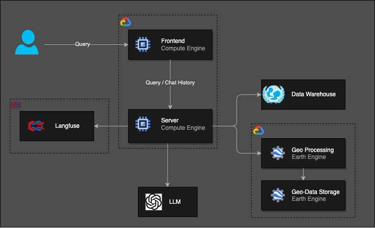

# Unicef Geospatial Project

This project is a collection of tools and scripts for working with geospatial data and AI.
The objective is to research and develop tools for interacting with geospatial data using natural language.

### Architecture



### Demo

https://github.com/user-attachments/assets/c4d4a8e6-a248-4231-b9dc-abbe9f13e11f

### Installing dependencies

The project API dependencies are managed using [`uv`](https://docs.astral.sh/uv/), while the frontend dependencies are managed via [`npm`](https://www.npmjs.com/).

To install the API dependencies:

```bash
uv sync
```

To install the frontend dependencies:

```bash
cd frontend
npm install
```

In order to run the project it's also needed the [gcloud CLI](https://cloud.google.com/sdk/docs/install#deb)

### Running the project

To run the project the API:

```bash
uv run python run.py
```

This will start a local server at `http://127.0.0.1:8000/`.

To run the frontend:

```bash
cd frontend
npm run dev
```

This will start a local server at `http://127.0.0.1:5173`.

### Secrets

The project uses [python-dotenv](https://github.com/theskumar/python-dotenv) to load environment variables from a `.env` file.

To copy the `.env.example` file to a new file called `.env`:

```bash
cp .env.example .env
```

The `.env` file should be located in the root of the project and contain the following variables:

- `OPENAI_API_KEY`: The API key for OpenAI.
- `MODEL_NAME`: The name of the OpenAI model to use.
- `TEMPERATURE = 0.0`: The temperature of the agent.
- `LANGFUSE_PUBLIC_KEY`: The public key for the langfuse cloud.
- `LANGFUSE_SECRET_KEY`: The secret key for the langfuse cloud.
- `LANGFUSE_HOST`: The host URL for the langfuse cloud.
- `LANGFUSE_PROJECT_ID`: The project id for the langfuse cloud.
- `BACKEND_HOST`: The API host address.
- `BACKEND_PORT`: The API port number.
- `PATH_TO_EE_AUTH`: The path to the earth engine auth file.

For authentication into the google earth engine, you need a service account and download the credentials file.
The file should be named `ee_auth.json` and placed in the root of the project. It should look like this:

```json
{
  "type": "service_account",
  "project_id": "XXX",
  "private_key_id": "XXX",
  "private_key": "XXX",
  "client_email": "XXX",
  "client_id": "XXX",
  "auth_uri": "XXX",
  "token_uri": "XXX",
  "auth_provider_x509_cert_url": "XXX",
  "client_x509_cert_url": "XXX",
  "universe_domain": "XXX"
}
```

### Accessing the logs

The logs are stored in langfuse cloud. They are accesible [here](https://cloud.langfuse.com/organization/cm6gkfzm100dxo9t33ydvuyxw).

### Running the benchmark

To run the benchmark, after installing the dependencies, run the following command:

```bash
uv run python tests/benchmark.py
```

This will log the results in langfuse cloud.

### Project structure

- `unicef_geospatial/`: The main project for working with geospatial data.

  - `agent/`: Functions for creating and running langchain agents.
  - `data_warehouse/`: Tools and functions for interacting with the unicef data warehouse.
  - `earth_engine/`: Functions for interacting with google earth engine.
  - `geospatial/`: Tools and functions for interacting with geospatial data.
  - `utils/`: Utility functions for the project.
  - `app.py`: The main entry point for the API.

- `unicef-frontend/`: The frontend for the project.

- `notebooks/`: Notebooks with interactive visualizations and demonstrations.
- `research/`: Research scripts for exploring geospatial data, unicef api, etc.

#### Notebooks

- `interactive_map.ipynb`: Ask questions in natural language about heatwave data.

#### Research

- `api_research.py`: Research on the unicef api, transform the sdmx-json to pandas dataframe.
- `ee_upload_images.py`: Upload heatwave data to google earth engine.
- `initial_research.py`: Research on how to use langchain agents to interact with a dataframe.
- `interact_geospatial.py`: Research on how to use langchain agents to interact with a geospatial data.
- `pandas_ai.py`: Research on how to use pandas-ai to interact with a unicef dataframe.
- `unicef_geospatial_ee.py`: Research on how to use google earth engine to interact with a geospatial data, creating an interactive map.

```

```
